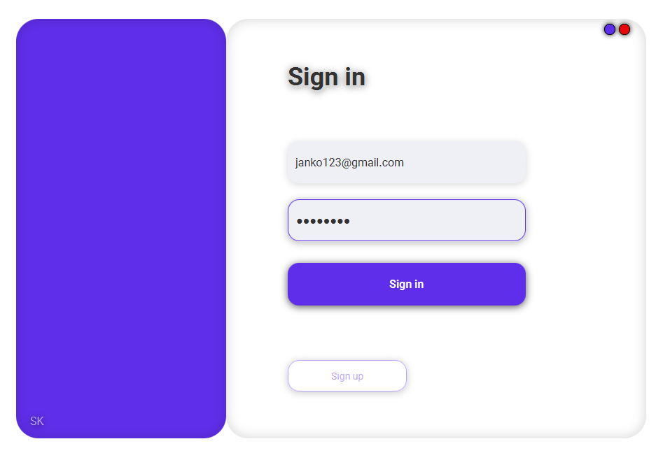
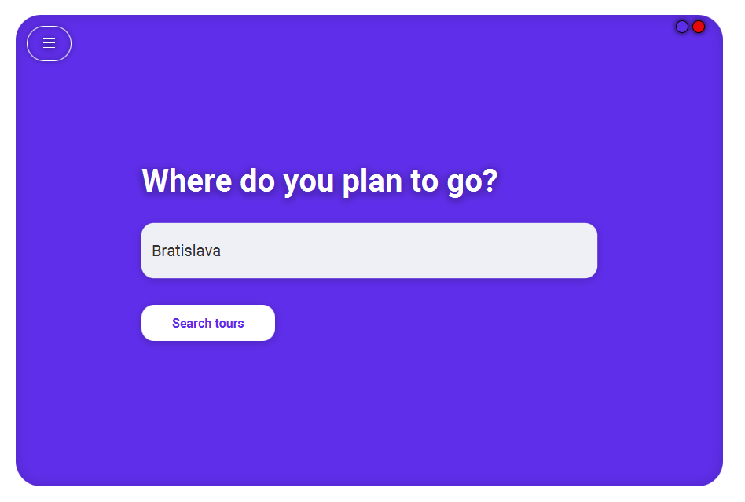
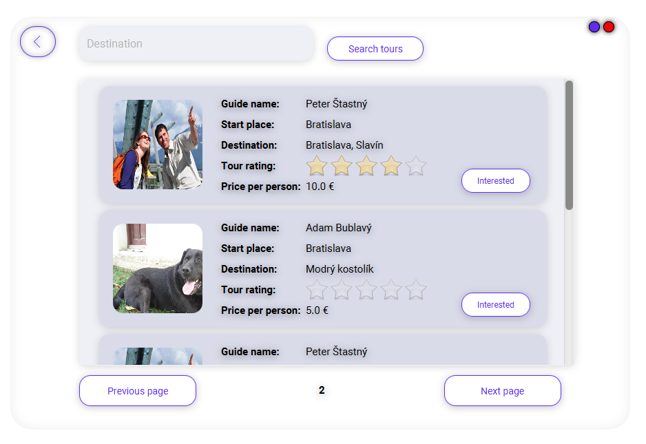
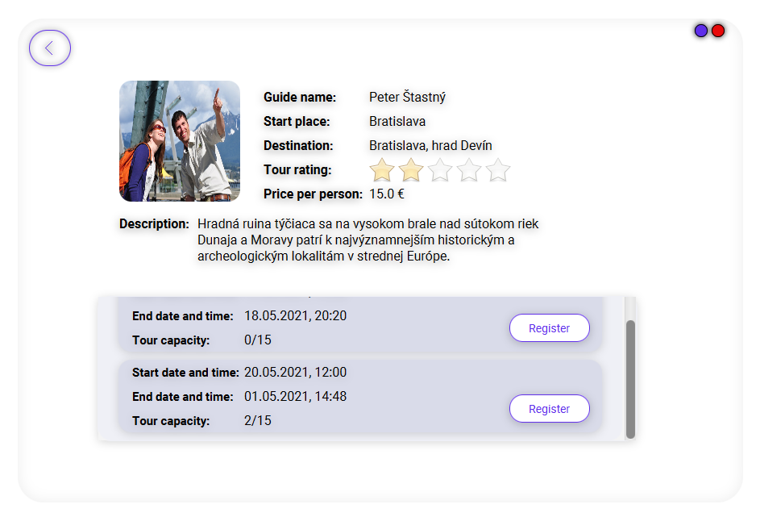
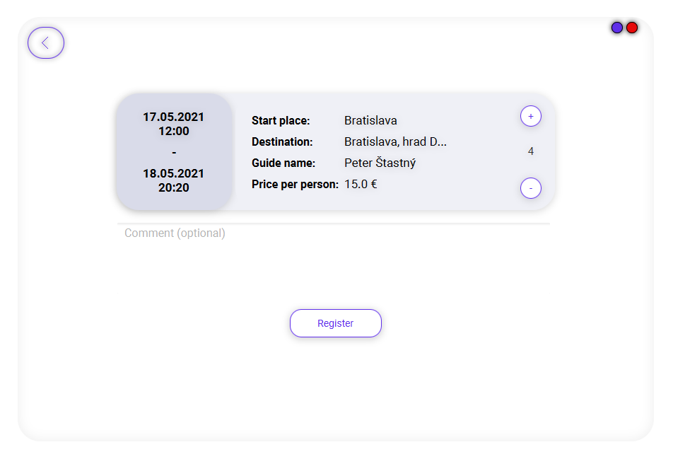
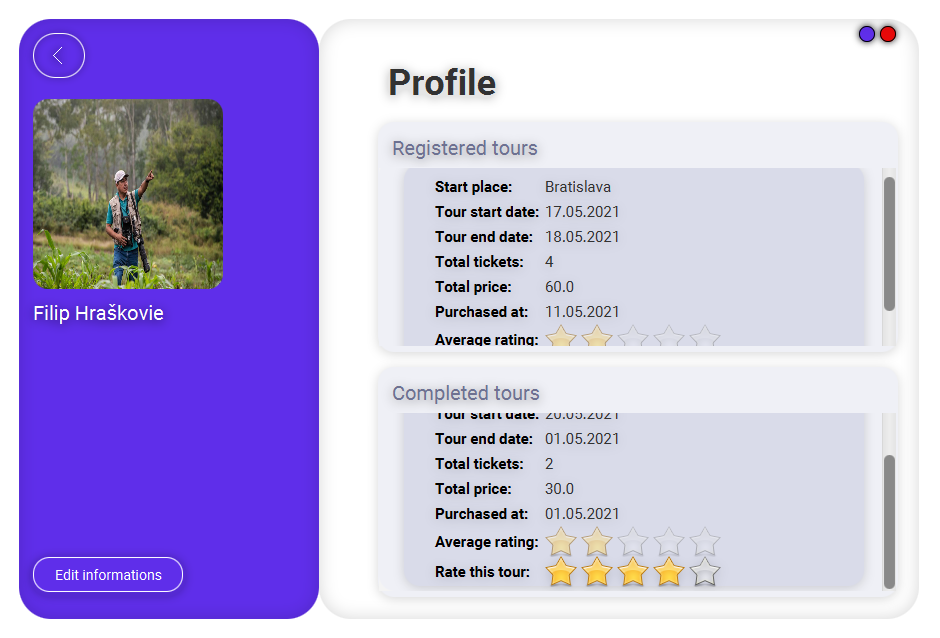
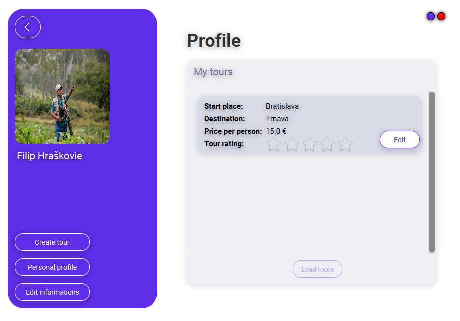

# VAVA - Semestrálny projekt

## O projekte

Aplikácia spája vášnivých turistov, ale aj bežných ľudí s lokálnymi turistickými sprievodcami. Aplikácia umožňuje používateľom vyhľadávať túry, či už podľa miesta destinácie alebo miesta štartu túry, a následne sa môže používateľ registrovať na určitý dátum túry podľa jeho preferovaného výberu.

Aplikácia funguje na podobnom princípe ako aplikácia Uber, ktorá umožňuje jej používateľom využívať taxikárske služby a zároveň poskytuje vykonávanie taxikárskych služieb bežným overeným vodičom. To znamená, že naša aplikácia takýmto spôsobom poskytuje prácu pre lokálnych profesionálnych sprievodcov, ale aj bežným lokálnym obyvateľom, ktorí danú destináciu dobre poznajú a môžu o nej porozprávať zaujímavosti bežným ľuďom. Týmto spôsobom sa teda môžu profesionálni sprievodcovia živiť a miestni nadšenci si môžu privyrobiť.

Túto aplikáciu sme sa rozhodli vytvoriť z toho dôvodu, pretože sme zatiaľ nezachytili, že by existovala podobná aplikácia, ktorá by poskytovala tento druh služby a bola by celosvetovo známa. Preto vidíme v tomto príležitosť vymyslieť niečo nové, čo by mohlo mať potenciál.

Aplikácia vznikla ako tímový projekt na predmete VAVA.

### Použité technológie

#### Frontend

-   Java 1.8
-   JavaFX
-   [Log4j](https://mvnrepository.com/artifact/org.apache.logging.log4j/log4j-core/2.14.1)
-   [Apache HttpClient](https://mvnrepository.com/artifact/org.apache.httpcomponents/httpclient/4.5.13)

#### Backend

-   Java 11
-   SpringBoot
-   REST
-   Lombok
-   PostgreSQL
-   JWT
-   Maven

## Inštalácia

### Frontend

1. Naklonujte repozitár

```sh
   git clone https://github.com/VAVA-project/project_frontend.git
```

2. V súbore XMLRequestParser prepíšte

```java
   private static final String serverAddress = "URL servera";
```

### Backend

1. Naklonujte repozitár

```sh
   git clone https://github.com/VAVA-project/project_backend.git
```

2. Nastavte systémové premenné

```
    DATABASE_URL =
    JWT_SECRET =
    SPRING_PROFILES_ACTIVE =
```

príklad

```
    DATABASE_URL = postgres://{user}:{password}@{hostname}:{port}/{database-name}
    JWT_SECRET = kQku9ciPeDs2GHRFSurv
    SPRING_PROFILES_ACTIVE = prod
```

## Ukážky obrazoviek z aplikácie

### Obrazovka prihlásenia

<div style="text-align:center;">
    
</div>

### Obrazovka vyhľadávania destinácií

<div style="text-align:center;">
    
</div>

### Obrazovka pre zobrazenie nájdených turistických ponúk

<div style="text-align:center;">
    
</div>

### Obrazovka pre zobrazenie dostupných termínov pre túru

<div style="text-align:center;">
    
</div>

### Obrazovka pre kúpu lístkov na túru

<div style="text-align:center;">
    
</div>

### Obrazovka osobného profilu používateľa

<div style="text-align:center;">
    
</div>

### Obrazovka vytvorených túr sprievodcu

<div style="text-align:center;">
    
</div>

## Odkazy na repozitáre

-   [Frontend](https://github.com/VAVA-project/project_frontend)
-   [Backend](https://github.com/VAVA-project/project_backend)
-   [Dokumentácia](https://github.com/VAVA-project/documentation)

## Kontakt

-   Adam Fagan - [GitHub](https://github.com/adamfagan) - [Email](mailto:fagan.adam@outlook.com)

-   Adam Bublavý - [GitHub](https://github.com/Sangalaa) - [Email](mailto:bublavy.adam@gmail.com)
